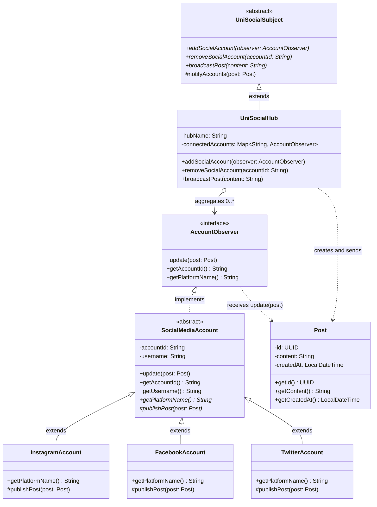

# Uni-Social Observer Pattern Design

## (a) Customizing the Observer class diagram for Uni-Social

Below is a domain-specific class diagram (Observer template customized with Uni-Social concepts):

### Key participation classes

- **Abstract subject**
  - `UniSocialSubject`
  - Defines abstract operations to:
    - add account
    - remove account
    - broadcast post
  - Contains implemented protected behavior: `notifyAccounts(post)`

- **Concrete subject**
  - `UniSocialHub`
  - Implements account registration/removal/broadcast logic.
  - Maintains collection of subscribed social accounts.

- **Abstract observer contract**
  - `AccountObserver` (interface)
  - Required methods: `update`, `getAccountId`, `getPlatformName`

- **Abstract observer base**
  - `SocialMediaAccount` (abstract class implementing `AccountObserver`)
  - Implements shared behavior (`update`, id/username accessors)
  - Leaves platform-specific publishing as abstract `publishPost`

- **Concrete observers**
  - `InstagramAccount`
  - `FacebookAccount`
  - `TwitterAccount`
  - Each implements platform-specific posting behavior

- **Domain payload**
  - `Post` as immutable message object distributed by subject

### Key relationships

- **Inheritance/extends**
  - `UniSocialHub extends UniSocialSubject`
  - `InstagramAccount/FacebookAccount/TwitterAccount extends SocialMediaAccount`

- **Subtyping/implements**
  - `SocialMediaAccount implements AccountObserver`

- **Aggregation/association**
  - `UniSocialHub` aggregates many `AccountObserver` subscribers
  - `UniSocialHub` creates `Post` and notifies all subscribed observers

### Behaviors (abstract and implemented)

- **Abstract behaviors**
  - In `UniSocialSubject`: `addSocialAccount`, `removeSocialAccount`, `broadcastPost`
  - In `SocialMediaAccount`: `publishPost`, `getPlatformName`

- **Implemented behaviors**
  - In `UniSocialSubject`: `notifyAccounts(post)` loops through observers
  - In `SocialMediaAccount`: `update(post)` delegates to `publishPost(post)`
  - In `UniSocialHub`: concrete account lifecycle and broadcast orchestration
  - In concrete account classes: platform-specific publish implementation
